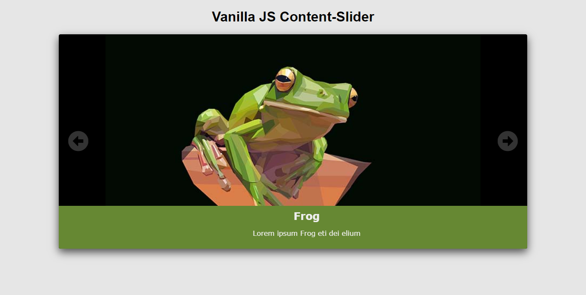
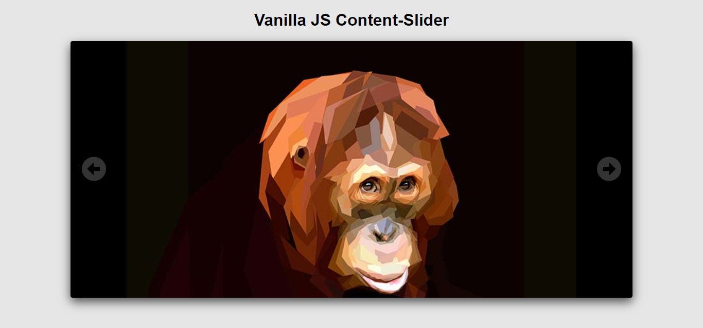

# JS Challenge - Content Slider 
> A set of 10 JQuery components written in pure Vanilla JS

## Highlights
* **Responsive layout**  
* **Prev and next buttons** 
* **infinite loop modality** 
* **Customizable transitions** 
* **Individual Text holders** 

#### Requirements 
* A real browser like firefox chrome or Safari
* A  \<div\> with id "slider" as container
* Import [Font Awesome](https://stackpath.bootstrapcdn.com/font-awesome/4.7.0/css/font-awesome.min.css) CDN

##### Future implementations
* refractor code into an ES6 class
* tune up the animation transitions
* add more customization.
